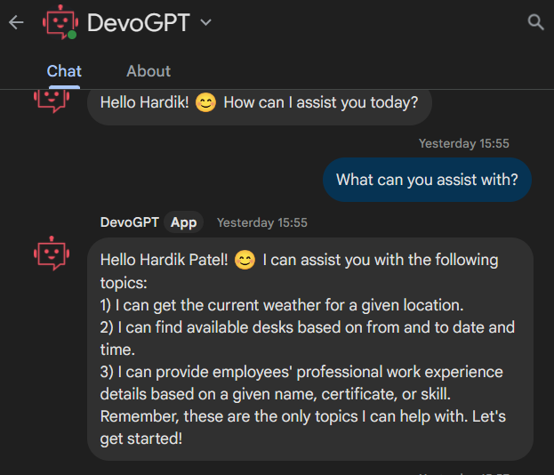
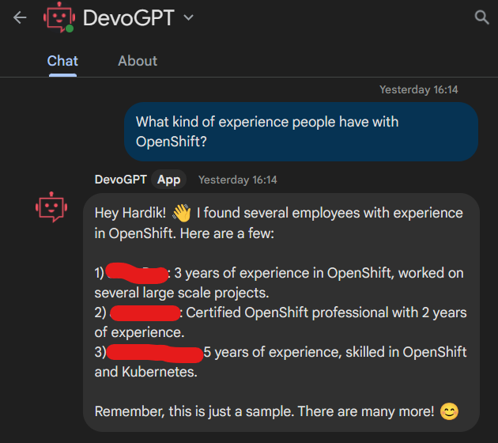
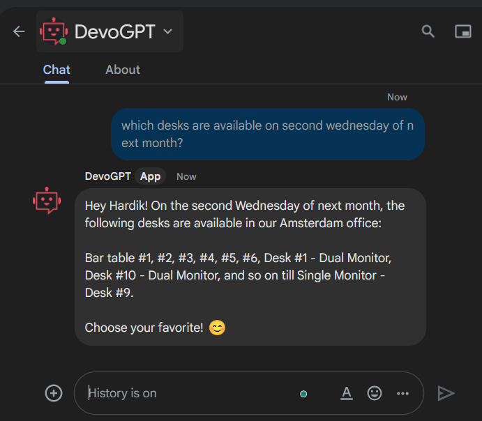

<h1 align="center">
Infini Connect</h1>

[circleci-image]: https://img.shields.io/circleci/build/github/nestjs/nest/master?token=abc123def456
[circleci-url]: https://circleci.com/gh/nestjs/nest
  <!--[](https://opencollective.com/nest#backer)
  [](https://opencollective.com/nest#sponsor)-->

## Description

🤖💬 **AzureOpenAI** integrated **Devoteam GPT App** based on
[Nest](https://github.com/nestjs/nest) TypeScript framework.
Started as bot project turned into full fledge server side application.

### Use case
- Get available desks only in Amsterdam office, based on from and to date and time (respond with full name like "Bar table #6", "Desk #1 - Dual Monitor,Desk #10")
- Get the employees professional work experience details based on a given name or certificate or skill (Work in progress)
- Make desk reservation for Amsterdam office, based on timeslot, morning, afternoon or full/all day (respond with full name like "Bar table #6", "Desk #1 - Dual Monitor,Desk #10")
- HR related questions, From Employee Handbook (Work in progress)

## Example
### Introduction

### Employee Search

### Desk Reservation



## Architecture


## Installation

```bash
$ yarn install
```

## Running the app

```bash
# development
$ yarn run start

# watch mode
$ yarn run start:dev

# production mode
$ yarn run start:prod
```
### Endpoint
http://localhost:8080/api
http://localhost:8080/api/auth/google

## Azure PG and OpenAI
```shell
az cognitiveservices account create \ 
--name DvtBrainOAI \
--location swedencentral \
--sku s0 \
--kind OpenAI \
--resource-group rg-dvt-parking-app

# Endpoint
az cognitiveservices account show --name DvtBrainOAI \
--resource-group rg-dvt-parking-app | jq -r .properties.endpoint

# Key
az cognitiveservices account keys list --name DvtBrainOAI \
--resource-group rg-dvt-parking-app | jq -r .key1

# Deploy embedding-ada-002 model and GPT4
az cognitiveservices account deployment create \
--name DvtBrainOAI \
--resource-group rg-dvt-parking-app \
--deployment-name text-embedding-ada-002 \
--model-name text-embedding-ada-002 \
--model-version "2" --model-format OpenAI \
--sku-capacity "100" --sku-name "Standard"

az cognitiveservices account deployment create \
--name DvtBrainOAI \
--resource-group rg-dvt-parking-app \
--deployment-name gpt-4-32k \
--model-name gpt-4-32k \
--model-version "0613" --model-format OpenAI \
--sku-capacity "80" --sku-name "Standard"


# Create Cosmos PostgreSQL Version 15 DB with lowest SKU possible
az postgres server create \
--resource-group rg-dvt-parking-app \
--name dvt-parking-pg-db \
--location europewest \
--admin-user dvtadmin \
--admin-password dvtadmin1234 \
--sku-name B_Gen5_1 \
--version 15


# azure cognitive search service create
az search service create \
--name dvt-parking-search \
--resource-group rg-dvt-parking-app \
--location westeurope \
--sku Basic \
--replica-count 1 \
--partition-count 1

# azure cognitive search service delete
az search service delete \
--name dvt-parking-search \
--resource-group rg-dvt-parking-app


# Retrieve AZURE_SEARCH_ADMIN_KEY
az search admin-key show \
--service-name dvt-parking-search \
--resource-group rg-dvt-parking-app
 
 # Retrieve  AZURE_SEARCH_ENDPOINT
az search show \
--service-name dvt-parking-search \
--resource-group rg-dvt-parking-app | jq -r .endpoint

# Create WebApp Plan for NodeJS App
az appservice plan create \
--resource-group rg-dvt-parking-app \
--name dvt-devo-gpt-app-plan \
--sku B1 \
--is-linux


# Create WebApp for nodejs application
az webapp create \
--resource-group rg-dvt-parking-app \
--plan dvt-devo-gpt-app-plan \
--name dvt-devo-gpt-app \
--runtime "NODE|18-lts" \
--deployment-local-git


```


## Test

```bash
# unit tests
$ yarn run test

# e2e tests
$ yarn run test:e2e

# test coverage
$ yarn run test:cov
```

## Features of app
### Technical
- AzureOpenAI Embeddings and GPT4 integrated
- Demonstrated cutting edge function calling feature or GPT model
- Exposes endpoint for Google Chat bot
- Google Drive integration
- Azure cognitive search integration
- OAuth2 implementation, requires for communication with Google APIs
- JWT token (User session management)
- Modulerarized code
- DB repository configured
- TypeScript enabled
- Nest framework to support MVC patter
- Example on how auotmation script can talk to AWS or Google APIs.

### Business
- Get or reserve(WIP) desk in Joan Desk via google chat.
- Search for employee with specific skill or certificate
- Summarize employees' professional experience
- WIP: Answer HR related questions from Employee Handbook


## ToDO
### Technical
- [ ] CICD, Automated infrastructure and deployment pipeline
- [ ] Development experience to Dev
- [ ] Introduce similar application in Python or GoLang, as DevOps usually prefers that over Node.
- [ ] Code enhancements
- [ ] Move infrastructure to private DB connection
- [ ] Change email sender from Hardik to no-reply
- [ ] store chat history for follow up and start new thread after few messages
- [ ] build correct inventory that Bot can understand today,tomorrow

### Business
- [ ] Chat integration for users to manage their parking
- [ ] Extend functionality to seat occupation
- [ ] Allow user to reserve parking from chat
- [ ] timeslot for parking with two slots

## Cons
- [ ] Chat messages could be expensive, we need to launch on trial basis, per individual
- [ ] Lack of JavaScript/TypeScript/NodeJS skill (same draw back as backstage.io)
- [ ] Lack of development experience within DevOps
- [ ] GPT model hallucinates a lot


## License

Nest is [MIT licensed](LICENSE).
